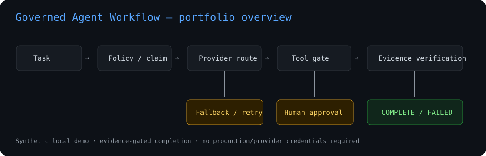

# Governed Agent Workflow Demo

> **Repository identity:** the GitHub slug `space-Y-` is historical. The default branch now contains the **Governed Agent Workflow Demo**; the prior coursework is preserved on the `legacy-space-y-coursework` branch.

**Sanitized AI-workflow engineering portfolio project.** A compact Python control plane showing how agent-style automation can be routed, authorized, observed and verified without trusting a worker/model's self-reported completion.

> **Scope:** local prototype / R&D portfolio project. It is **not** an enterprise production AI platform, commercial deployment, large-scale MLOps system, or production LLM platform.



## The problem

Agent workflows can fail silently or claim completion too early: providers become unavailable or rate-limited, structured output is malformed, a model selects a tool it should not use, approval can be stale or replayed, a process can restart after a partial side effect, or a worker can say “done” while the required artifact is missing.

The engineering question in this repository is therefore:

**How do you make agent execution explicit, least-privilege, failure-aware, restart-aware and evidence-gated?**

## What is implemented

- strict structured task schema and rule-based decomposition;
- deterministic provider routing;
- provider adapter interface;
- provider health states: `HEALTHY / DEGRADED / DOWN`;
- bounded retry and provider-class failure taxonomy;
- circuit breaker and provider fallback;
- explicit per-task tool allowlists;
- tool risk / side-effect metadata;
- dry-run execution;
- human approval with task/action hash binding, expiry and replay prevention;
- SQLite-backed idempotency across engine restarts;
- fail-closed detection of incomplete/crashed prior execution;
- artifact evidence receipts with SHA-256, size and timestamps;
- receipt-level integrity digest;
- stale/missing/changed-artifact detection;
- tamper-evident audit event chain;
- optional Git repository-state inspection;
- parent/child completion groups that require verified child evidence;
- process-local metrics;
- automated CI/portfolio acceptance checks.

```text
Task
  ↓
Strict parser + rule-based decomposition
  ↓
Persistent claim / idempotency gate
  ↓
Deterministic router ── provider health / circuit state
  ├── Provider A
  ├── Provider B
  └── fallback only for provider-class failures
  ↓
Structured action
  ↓
Explicit tool allowlist
  ↓
Dry-run or bounded approval gate
  ↓
Tool execution
  ↓
Evidence receipt + tamper-evident audit
  ↓
Independent verification gate
  ↓
COMPLETE / FAILED / RECOVERY_REQUIRED
```

## 60-second local demo

Requires Python 3.11+ and no API credentials.

```bash
python -m venv .venv
source .venv/bin/activate        # Windows: .venv\Scripts\activate
pip install -e .[dev]

python scripts/acceptance_check.py
```

Or run the scenarios individually:

```bash
python -m governed_agent.demo --scenario success
python -m governed_agent.demo --scenario fallback
python -m governed_agent.demo --scenario approval
```

Each scenario returns an execution record, metrics, provider-health snapshot and `audit_integrity` result.

### Scenario 1 — verified success

A deterministic provider proposes an allowlisted write. The tool creates the required artifact. Completion occurs only after the receipt and current artifact verify.

### Scenario 2 — provider failure and fallback

`provider-a` simulates a rate-limit failure. The failure is classified; provider health degrades; routing moves to `provider-b`, which completes the task. Tool failure would **not** trigger the same blind cross-provider replay.

### Scenario 3 — human approval before side effect

The exact action is bound to an approval hash. The approval is time-bounded and one-time-use. A denied, expired, replayed or action-mismatched approval is rejected before the tool executes.

## What the tests prove

The current suite covers 35 behavioral checks, including:

- normal completion;
- unavailable provider;
- quota/rate failure;
- timeout;
- malformed structured output;
- provider fallback;
- circuit opening and unhealthy-provider skipping;
- tool failure;
- non-allowlisted tool rejection;
- dry-run behavior;
- approval denial;
- approval action substitution;
- approval expiry;
- approval replay;
- missing evidence;
- stale evidence;
- changed artifact with the same file size;
- evidence-receipt tampering;
- false completion without required artifact;
- duplicate task execution;
- persistent idempotency across engine restart;
- incomplete/crashed prior execution requiring explicit recovery;
- audit-chain persistence and tamper detection;
- Git repository clean/dirty state inspection;
- child self-report not closing a parent completion group;
- verified child evidence satisfying a completion group;
- process-local metrics.

Run only the tests:

```bash
pytest -q
```

## Key engineering decisions

### 1. Provider output is not execution authority

A provider proposes a structured action. The engine independently checks whether the selected tool is explicitly allowed for that task. Provider output cannot expand its own permissions.

### 2. Fallback is failure-class aware

Provider outage, rate limit, timeout and malformed provider output may move to another provider. A tool failure does not automatically replay against another provider because the side effect may have partially happened already.

### 3. Approval is bound to the exact action

Approval contains an ID, actor, task ID, SHA-256 of the requested action, creation time and expiry. It is consumed once. This is stronger than a generic `approved=true` flag while remaining small enough for a portfolio demo.

### 4. Restart does not erase idempotency

A standard-library SQLite store persists task claims. A new engine process cannot repeat a completed logical task with the same idempotency key. If a previous execution is still non-terminal, the engine returns `RECOVERY_REQUIRED` instead of silently replaying a possible side effect.

### 5. “Done” is not proof

Completion requires a valid evidence receipt and current artifact verification. A separate parent/child completion primitive also refuses to accept a child record that says `COMPLETE` but has no evidence receipt.

### 6. Audit history is independently checkable

Execution events form a SHA-256-linked chain. Historical mutation breaks `verify_integrity()`. This is a demonstration of audit integrity, not a replacement for a production append-only log or external attestation system.

## Metrics

The local metrics object exposes:

- task success/failure rate;
- provider attempts/failures;
- fallback success;
- circuit-open count;
- tool-call success and authorization failures;
- verification failures;
- retry count;
- approval frequency/denials/invalid approvals;
- duplicate/recovery blocks;
- audit-event count;
- average task latency.

These metrics are **process-local**. The repository does not claim production telemetry, dashboards, distributed tracing or SLOs.

## Repository structure

```text
src/governed_agent/
  models.py          # task, failure, approval, evidence and execution schemas
  planning.py        # strict parser + deterministic decomposition
  providers.py       # adapter interface, provider health and circuit breaker
  router.py          # deterministic health-aware provider ordering
  tools.py           # explicit tool registry, risk metadata and allowlists
  approvals.py       # action-bound, expiring, one-time approval
  state.py           # SQLite task claims / restart-safe idempotency
  audit.py           # tamper-evident event chain
  evidence.py        # artifact + receipt integrity
  verification.py    # evidence-based completion gate
  completion.py      # verified parent/child completion semantics
  repository.py      # local Git state inspection
  metrics.py         # process-local metrics
  engine.py          # workflow state transitions and failure policy
  demo.py            # recruiter-facing reproducible scenarios

tests/               # success + adversarial/failure behavior
scripts/             # one-command portfolio acceptance
examples/            # scenario runner
data/                # synthetic sample task data
docs/                # architecture, capability matrix, threat model, task pack
```

## Honest scope and limitations

This repository deliberately does **not** implement or claim:

- real production LLM/provider integrations;
- enterprise/customer deployment;
- a distributed multi-agent scheduler;
- a persistent distributed queue, leases or consensus;
- production authentication/authorization or tenant isolation;
- a production secrets manager;
- signed approvals from a real identity provider;
- sandboxed arbitrary-code execution;
- Kubernetes or large-scale MLOps;
- production observability infrastructure;
- an MCP server/client implementation — the tool-permission model demonstrates **MCP-style least-privilege integration concepts** only;
- RAG, embeddings, vector databases, LangChain, LangGraph or Azure OpenAI;
- autonomous correctness guarantees.

## Background represented honestly

This repository is a sanitized reference implementation of control patterns explored in broader personal agent-orchestration and automation R&D: task routing, provider/model failures, fallback, bounded delegation, tool execution, human approval, queues, artifact/repository checks, false-completion detection, recovery and quality gates.

Only behavior present and testable in this public repository should be described as **implemented here**. Broader Hermes/MCP/model-routing work should be described as personal R&D/engineering experience unless separately evidenced.

## Evidence index

- [`docs/CAPABILITY_MATRIX.md`](docs/CAPABILITY_MATRIX.md) — claim → source → test mapping
- [`docs/ARCHITECTURE.md`](docs/ARCHITECTURE.md) — 10-minute engineering walkthrough
- [`docs/AI_PORTFOLIO_STRENGTHENING_TASKS.md`](docs/AI_PORTFOLIO_STRENGTHENING_TASKS.md) — executed improvement task pack
- [`docs/THREAT_MODEL.md`](docs/THREAT_MODEL.md) — trust boundaries and residual risks
- [`docs/INTERVIEW_EVIDENCE.md`](docs/INTERVIEW_EVIDENCE.md) — defensible interview explanations
- [`PORTFOLIO_REVIEW.md`](PORTFOLIO_REVIEW.md) — final acceptance verdict
- [`AI_PORTFOLIO_CV_BLOCK.md`](AI_PORTFOLIO_CV_BLOCK.md) — recruiter-safe CV wording

## Related portfolio

- [Industrial Quality Documentation Assistant](https://github.com/lemoniadowyjohn/hermes) — industrial RAG portfolio project using synthetic data and evidence-grounded validation.
- [CARLA Control Suite / map-quality portfolio work](https://github.com/lemoniadowyjohn/carla-control-suite) — automotive simulation, geospatial validation and reproducibility work.


## Portfolio navigation

- [Engineering portfolio matrix](PORTFOLIO_MATRIX.md) — problem, technologies, evidence and target-role mapping across the public portfolio.
- [Ready-to-publish GitHub profile README](GITHUB_PROFILE_README.md) — concise profile landing copy.
- [Industrial Quality Documentation Assistant](https://github.com/lemoniadowyjohn/hermes)
- [CARLA Map Quality Toolkit](https://github.com/lemoniadowyjohn/carla-control-suite)
- [Python Excel Data Reconciliation Demo](https://github.com/lemoniadowyjohn/space-Y--)
- [Power Platform Quality App Reference Design](https://github.com/lemoniadowyjohn/watson)


## Synthetic sample data

[`data/sample_tasks.json`](data/sample_tasks.json) contains public-safe example tasks for success, fallback and approval scenarios. It contains no employer/customer data.
